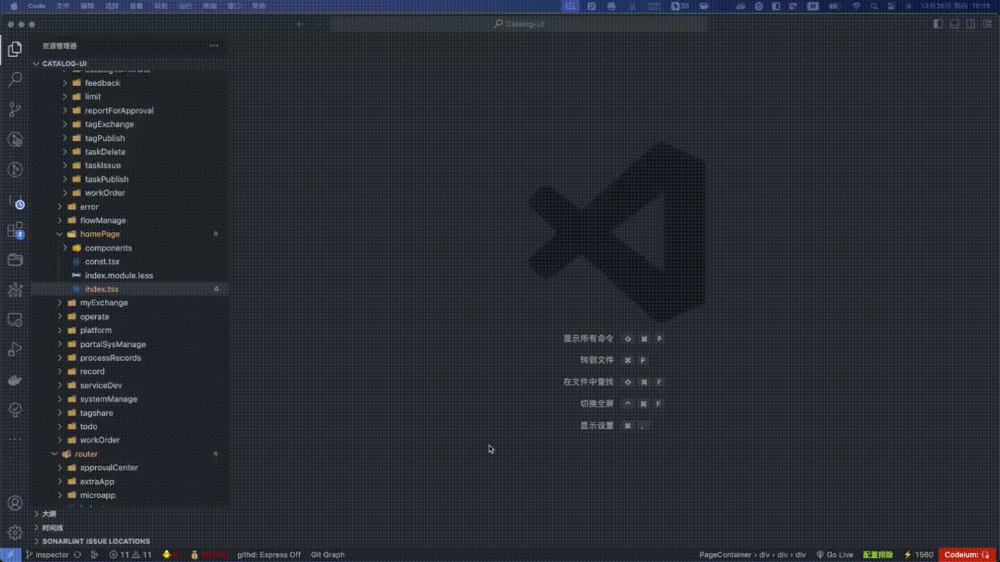

# 开发环境 vscode 组件定位

维护人： xuelin

<!-- > 开发环境 vscode 组件定位 -->

> 

## 安装

```sh
npm i @wxl/dev-inspector
or
yarn add @wxl/dev-inspector
```

### 用法

```
if(process.env.NODE_ENV === 'development'){

  require('@wxl/dev-inspector').createDevInspector('wxl')//组件wxl前缀给弹窗使用
}

// mac command + 鼠标右键 跳转vscode文件
// windows ctrl + 鼠标右键 跳转vscode文件

```

> 说明 @babel/preset-react 需要设置 development

```babel
[
  '@babel/preset-react',
  {
    development: process.env.NODE_ENV === 'development'
  }
]
```

> swc-loader 不需要修改配置
