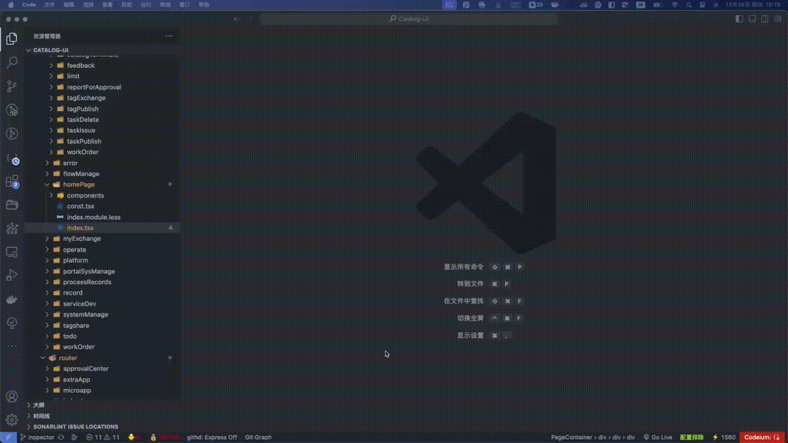

# react 开发环境 vscode 组件定位

维护人： xuelin

## 功能

用于 React 应用开发的调试工具，允许开发者通过快捷键（Ctrl/Cmd）+ 右键点击组件，快速定位组件在源代码中的位置。

> 

## 思路

```bash
// 流程图解
                     +---------------------+
      | 用户  Ctrl（Windows）或 Cmd+contorl（Mac）并右键点击元素 |
                     +---------------------+
                                |
                                v
                     +---------------------+
                     | 获取 DOM 元素 e.target |
                     +---------------------+
                                |
                                v
              遍历所有属性 Object.entries(e.target)
                                |
                                v
              +---------------------------------+
              | 检查属性值是否为 FiberNode 实例？ |
              +---------------------------------+
                | 是                        | 否
                v                           v
      记录 Fiber 节点到 list         继续遍历下一个属性
                |
                v
     通过 _debugOwner 递归父节点
                |
                v
      弹窗显示源码位置或打印日志
```

关键步骤：

利用 Fiber 架构中`_debugSource` 和 `_debugOwner`是用于调试的内部属性，它们仅在 开发环境 中存在，帮助开发者追踪组件的来源和层级关系。

### `_debugSource`

作用：记录当前 Fiber 节点对应的组件在源码中的位置信息（如文件路径、行号、列号）。

格式：它是一个对象，包含以下字段：

```js
{
  fileName: string,     // 组件所在的文件路径（如 "src/components/Button.js"）
  lineNumber: number,   // 组件定义或实例化的起始行号
  columnNumber: number, // 组件定义或实例化的起始列号
}
```

假设有一个函数组件 Child 定义在 src/components/Child.js 的第 5 行第 8 列：

```js
// src/components/Child.js
function Child() {
  return <div>Child Component</div>;
}
```

对应的 `_debugSource` 可能是：

```javascript
{
  fileName: "src/components/Child.js",
  lineNumber: 5,
  columnNumber: 8
}
```

### `_debugOwner`

作用：指向当前 Fiber 节点的“所有者”组件（通常是父组件或创建该 Fiber 的组件）。

格式：它是一个 Fiber 节点的引用，包含以下关键字段：

```javascript
{
  type: Function | string, // 组件类型（如函数组件、类组件或HTML标签名）
  key: string | null,      // 组件的 key（如果有）
  elementType: Function,   // 组件的实际类型（可能与 type 相同）
  _debugSource: { ... },   // 所有者的源码位置（与上述格式一致）
  // ... 其他 Fiber 内部属性（如 stateNode、tag 等）
}
```

假设有一个父组件 Parent 渲染了 Child：

```js
// src/components/Parent.js
function Parent() {
  return (
    <div>
      <Child />
    </div>
  );
}
```

在 Child 对应的 Fiber 节点中，`_debugOwner`可能指向 Parent 的 Fiber 节点：

```javascript
{
  type: Parent, // 父组件的函数引用
  key: null,
  elementType: Parent,
  _debugSource: {
    fileName: "src/components/Parent.js",
    lineNumber: 3,
    columnNumber: 7
  },
  // ... 其他 Fiber 属性
}
```

### VSCode 链接

使用 vscode:// 协议生成链接，点击可直接在 VSCode 中打开对应文件并跳转到指定行和列。

## 代码

```js
import { Modal } from 'antd';

type DebugSource = {
  fileName: string;
  columnNumber: number;
  lineNumber: number;
};
type Fiber = {
  _debugSource?: DebugSource;
  _debugOwner?: Fiber;
};

const getTreeMessage = (fiber: Fiber) => {
  if (!fiber) return [];
  const arr = [];
  if (fiber._debugSource) {
    arr.push(fiber._debugSource);
  }
  let owner = fiber._debugOwner;
  while (owner) {
    if (owner._debugSource) {
      arr.push(owner._debugSource);
    }
    owner = owner._debugOwner;
  }
  return arr;
};

export const createDevInspector = (prefixCls = 'dt') => {
  const fn = (e: MouseEvent) => {
    if ((e.metaKey || e.ctrlKey) && e.target) {
      const [_, fiber] =
        (Object.entries(e.target).find(
          ([k]) =>
            e.target?.[k as keyof typeof e.target]?.constructor?.name ===
            'FiberNode',
        ) as [string, Fiber]) ?? [];

      const list = getTreeMessage(fiber);
      if (list.length) {
        e.preventDefault();
        Modal.info({
          title: '组件详情',
          width: '800px',
          prefixCls: `${prefixCls}-modal`,
          content: (
            <ul>
              {list.map((obj) => {
                return (
                  <li key={obj?.fileName}>
                    <a
                      href={`vscode://file/${obj.fileName}:${obj.lineNumber}:${obj.columnNumber}`}
                      target="_blank"
                      rel="noreferrer"
                    >
                      {obj?.fileName}
                    </a>
                  </li>
                );
              })}
            </ul>
          ),
        });
      } else {
        console.log(fiber, e.target);
      }
    }
  };
  document.addEventListener('contextmenu', fn);
  return () => {
    document.removeEventListener('contextmenu', fn);
  };
};

```

### 注意点

1. e.target

- e.target 是原生的 DOM 元素，React 不会直接将 Fiber 节点暴露在 e.target 上，而是通过特殊机制将其关联到 DOM 元素。
- React 在渲染时，会通过内部机制将 Fiber 节点挂载到 DOM 元素的 自定义属性 上。
  这些属性的名称是动态生成的，通常格式为 `__reactFiber$<随机哈希> 或 __reactInternalInstance$<随机哈希>`。例如：

```javascript
// 实际 DOM 元素上可能存在的属性
buttonElement.**reactFiber$abcd1234 = fiberNode;
buttonElement.**reactInternalInstance$abcd1234 = fiberNode;
```

随机哈希：React 为避免属性名冲突，会在属性名中加入随机字符串。

隐藏性：这些属性是内部使用的，不会出现在常规 DOM 属性遍历中。

Object.entries(e.target) 为了找到这些隐藏的 Fiber 节点属性，必须 遍历 DOM 元素的所有属性，检查哪些属性的值是 FiberNode 实例。


## 安装

```sh
npm i @xuelin/react-dev-inspector
or
yarn add @xuelin/react-dev-inspector
```

### 用法

```
if(process.env.NODE_ENV === 'development'){

  require('@xuelin/react-dev-inspector').createDevInspector('wxl')//组件wxl前缀给弹窗使用
}

// mac command + 鼠标右键 跳转vscode文件
// windows ctrl + 鼠标右键 跳转vscode文件

```

> 说明 @babel/preset-react 需要设置 development

```babel
[
  '@babel/preset-react',
  {
    development: process.env.NODE_ENV === 'development'
  }
]
```

> swc-loader 不需要修改配置
