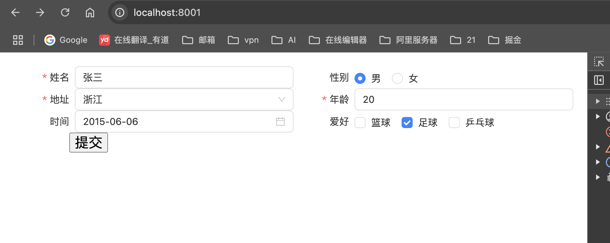

# vue3-form 基架

维护人： xuelin

> 

提前注册好表单项，<span style='color: red'>必须注册不然在 json 解析时候找不到对应的 key 无法渲染<span>

```js
import { createApp } from 'vue';
import { createPinia } from 'pinia';
import Antd from 'ant-design-vue';

import {
  Input,
  RadioGroup,
  Select,
  DatePicker,
  CheckboxGroup,
} from 'ant-design-vue';
import 'ant-design-vue/dist/reset.css';
import '@xuelin/vue3-form/dist/style.css';
import { registerComponents } from '@xuelin/vue3-form';

import App from './App.vue';
import router from './router';

// 注册表单组件
registerComponents({
  Input,
  RadioGroup,
  Select,
  CheckboxGroup,
  DatePicker,
});

const app = createApp(App);

app.use(createPinia());
app.use(router);

app.use(Antd).mount('#app');
```

```vue
<template>
  <Form span="12" :columns="columns" ref="form">
    <template>
      <slot></slot>
    </template>
    <FormItem span="24" label="">
      <Button type="primary" @click="submit">提交</Button>
    </FormItem>
  </Form>
</template>
<script setup>
import { Form, FormItem, defineColumns } from '@xuelin/vue3-form';
import { ref } from 'vue';

const columns = defineColumns([
  {
    label: '姓名',
    el: 'Input',
    field: 'name',
    rules: { required: true, message: '请输入姓名' },
    props: {
      value: '张三',
    },
  },
  {
    label: '性别',
    field: 'sex',
    el: 'RadioGroup',
    props: {
      value: '男',
      options: [
        { label: '男', value: '男' },
        { label: '女', value: '女' },
      ],
    },
  },
  {
    label: '地址',
    field: 'address',
    el: 'Select',
    props: {
      style: { width: '100%' },
      value: '浙江',
      options: [
        { label: '浙江', value: '浙江' },
        { label: '江苏', value: '江苏' },
      ],
    },
    rules: { required: true, message: '请输入地址' },
  },
  {
    label: '年龄',
    el: 'Input',
    field: 'age',
    props: {
      type: 'number',
      value: 20,
    },
    rules: { required: true, message: '请输入年龄' },
  },
  {
    label: '时间',
    el: 'DatePicker',
    field: 'time',
    props: {
      style: { width: '100%' },
      value: '',
      onChange: (val) => (time.value = dayjs(val)),
    },
  },
  {
    label: '爱好',
    el: 'CheckboxGroup',
    field: 'hobby',
    props: {
      value: ['篮球'],
      options: ['篮球', '足球', '乒乓球'],
      onChange: (val) => console.log('val :', val),
    },
  },
]);
const form = ref();
const submit = async () => {
  const data = await form.value.validate();
  console.log('data :', data);
};
</script>
```

## 安装

```sh
npm i @xuelin/vue3-form
or
yarn add @xuelin/vue3-form
```

## API
